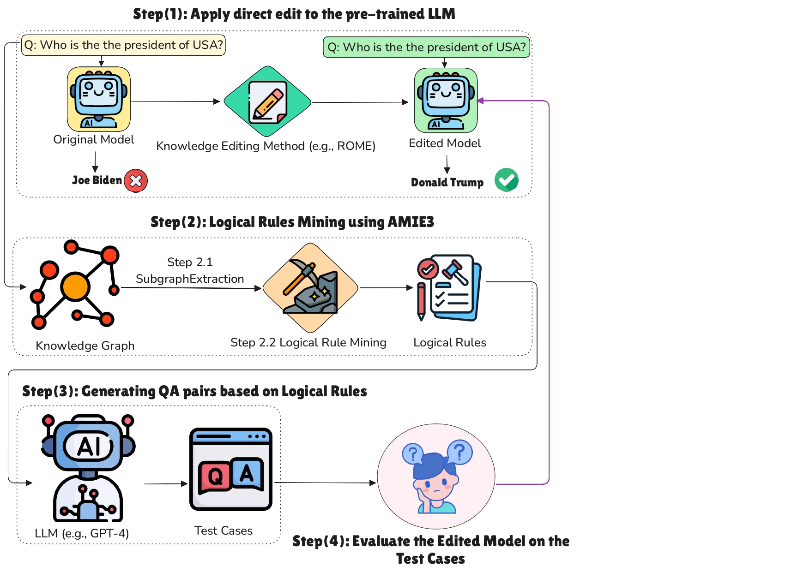

# Benchmarking-KE

This repository contains a benchmark evaluation of Knowledge Editing using logical rules. Our methodology includes multi-hop questions generated using logical rules to evaluate the effectiveness of knowledge editing methods. We conducted experiments on the popular approaches ROME, FT and KN and, the results show a considerable performance gap of up to 24% between evaluations on directly edited knowledge and on entailed knowledge particularly on ROME and FT.

<p align="center">
  
</p>

## Installation

To start, install the required packages:

```
cd evaluate_rules
pip install torch
pip install -r requirements.txt
```
Ensure that all dependencies are correctly installed

## SPARQL Querry

To get triples from the KG, we extracted entities in [MLaKE](https://github.com/Hi-archers/MLaKE/blob/main/dataset/single_hop/en_qa.json) and [MQuAKE](https://github.com/princeton-nlp/MQuAKE) which we use to query the DICE Dbpedia endpoint and construct our sub-knowledge graph. We use the following SPARQL queries :

```
    query = f"""SELECT ?s ?p ?o
    WHERE {{
      {{
        SELECT ?s ?p ?o WHERE {{
          VALUES ?s {{ <{entity_uris}> }}
          ?s ?p ?o
          FILTER (
            ?p != <http://www.w3.org/1999/02/22-rdf-syntax-ns#type> &&
            ?p != <http://www.w3.org/2000/01/rdf-schema#label> &&
            ?p != <http://www.w3.org/2002/07/owl#sameAs> &&
            ?p != <http://dbpedia.org/property/wikiPageUsesTemplate> &&
            ?p != <http://dbpedia.org/ontology/wikiPageRedirects> &&
            ?p != <http://dbpedia.org/ontology/almaMater> &&
            ?p != <http://dbpedia.org/ontology/wikiPageExternalLink> &&
            ?p != <http://dbpedia.org/ontology/wikiPageWikiLink> &&
            ?p != <http://www.w3.org/2000/01/rdf-schema#comment>
          )
        }}
        LIMIT 100
      }} UNION
      {{
        SELECT ?s ?p ?o WHERE {{
          VALUES ?o {{ <{entity_uris}> }}
          ?s ?p ?o
          FILTER (
            ?p != <http://www.w3.org/1999/02/22-rdf-syntax-ns#type> &&
            ?p != <http://www.w3.org/2000/01/rdf-schema#label> &&
            ?p != <http://www.w3.org/2002/07/owl#sameAs> &&
            ?p != <http://dbpedia.org/property/wikiPageUsesTemplate> &&
            ?p != <http://dbpedia.org/ontology/wikiPageRedirects> &&
            ?p != <http://dbpedia.org/ontology/almaMater> &&
            ?p != <http://dbpedia.org/ontology/wikiPageExternalLink> &&
            ?p != <http://dbpedia.org/ontology/wikiPageWikiLink> &&
            ?p != <http://www.w3.org/2000/01/rdf-schema#comment>
          )
        }}
        LIMIT 100
      }}
    }}"""
```
    
To get the triples files in the corrected form, run:
```
cd evaluate_rules/
python SparqlQuery.py
```


## Running AMIE

To get the rules, run the following commands:

```
cd evaluate_rules/amie
java -jar amie-dev.jar  -mins 1 ../all_triples/processed_triples3.txt > ../all_triples/output_file.txt
```
  
Make sure that you have the latest version [Java] installed to run AMIE, Download an AMIE executable jar file [AMIE-JAR], and run the commands above.
  
  
## Generating Multihop Questions and Answers

To generate the questions and answer run:
  
  ```python generateQA.py```
  
The outputs print the question and the answer related to the given rules and facts and save the QA dict into a file.
 
The datasets used in the experiments, all triples, rules and multihop_qa_pairs for each dataset are found in /evaluate_rules/all_triples .
 
 
## Running KE Methods

We first run KE methods over the selected datasets (MLaKE and MQuAKE) and save the models weights
To do so, you will need to clone rome repository into your local folder, and  and run the following commands :

```
git clone https://github.com/kmeng01/rome.git
cd rome/rome  or cd rome/baselines for others KE

python rome_main.py --model_name openai-community/gpt2-large --dataset_path ../evaluate_rules/all_triples/MLaKE/new_en-qa.json --config ../hparams/ROME/gpt2-large.json --save_dir edited_models  #Feel free to change the model and the datasets path
```

Config files for each KE can be found in /hparams and others KE are placed in /baselines. Some examples of python code used to run each KE are found in /examples folder.
 
## Evaluating KE Methods

To evaluate existing KE techniques on directly edited or correlated knowledge after saving models weights, run the followings commands .

```
python evaluate_rules/rome_eval.py  #for correlated knowledge 
python evaluate_rules/rome_eval_direct   #for directly edited knowledge
```
This will save the evaluation results in /results


## Results on LLMs

### ROME

<table>
  <tr><th align="left"></th><th>MLaKE</th><th>MQuAKE</th></tr>
  <tr><th align="left"></th>Models<th>F1</th><th>F1</th></tr>
  <tr><th align="left">gpt2-medium</th><td>16.36</td><td>4.21</td></tr>
  <tr><th align="left">gpt2-large</th><td>10.23</td><td>2.13</td></tr>
  <tr><th align="left">gpt2-xl</th><td>12.90</td><td>1.51</td></tr>
  <tr><th align="left">gpt-j</th><td>F1</td><td> - </td></tr>
  <tr><th align="left">Correlated knowledge</th></tr>
  <tr><th align="left">gpt2-medium</th><td>8.67</td><td>1.91</td></tr>
  <tr><th align="left">gpt2-large</th><td>6.08</td><td>2.42</td></tr>
  <tr><th align="left">gpt2-xl</th><td>7.17</td><td>3.84</td></tr>
  <tr><th align="left">gpt-j</th><td>8.56</td><td> 15.91 </td></tr>
</table>

### FT

<table>
  <tr><th align="left"></th><th>MLaKE</th><th>MQuAKE</th></tr>
  <tr><th align="left"></th>Models<th>F1</th><th>F1</th></tr>
  <tr><th align="left">gpt2-medium_constr</th><td>15.18</td><td>4.97</td></tr>
  <tr><th align="left">gpt2-large_const</th><td>24.58</td><td>9.10</td></tr>
  <tr><th align="left">gpt2-xl_constr</th><td>17.15</td><td>4.25</td></tr>
  <tr><th align="left">Correlated knowledge</th></tr>
  <tr><th align="left">gpt2-medium_constr</th><td>0.90</td><td>0.008</td></tr>
  <tr><th align="left">gpt2-large_constr</th><td>0.45</td><td>0.28</td></tr>
  <tr><th align="left">gpt2-xl_constr</th><td>0.63</td><td>0.0</td></tr>
</table>

### KN

<table>
  <tr><th align="left"></th><th>MLaKE</th><th>MQuAKE</th></tr>
  <tr><th align="left"></th>Models<th>F1</th><th>F1</th></tr>
  <tr><th align="left">gpt2-xl</th><td>1.34</td><td>4.67</td></tr>
  <tr><th align="left">Correlated knowledge</th></tr>
  <tr><th align="left">gpt2-xl</th><td>14.26</td><td>18.53</td></tr>
</table>


## Maintenance Plan

In the future, we will conduct the following experiments by adding other KE methods such as:
- `MEND`
- `KE`
- `MeLLo`

Including the following knowledge graphs:
- `Wikidata`
- `YAGO`

<table>
  <tr><th align="left">Model</th><th>Status</th></tr>
  <tr><th align="left">LLama2</th><td>Upcoming</td></tr>
  <tr><th align="left">GPT-3-based architectures</th><td>In progress</td></tr>
  <tr><th align="left">Mistral</th><td>Upcoming</td></tr>
</table>
 
## Citation

```
 Moteu Ngoli, T. (2025). Benchmarking Knowledge Editing using Logical Rules (1.0.0) [Data set]. THE 24th INTERNATIONAL SEMANTIC WEB CONFERENCE (ISWC 2025), Nara, Japan. Zenodo. https://doi.org/10.5281/zenodo.15697400
```

## DOI
[https://doi.org/10.5281/zenodo.15697400](https://doi.org/10.5281/zenodo.15697400)
 
## Contact
Feel free to contact us at tatianam@mail.uni-paderborn.de if you have any questions.
